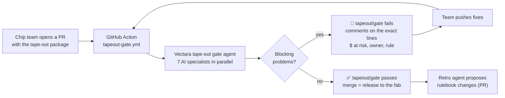

# KESTREL tape-out package — CI for chips

> **Fictional demo.** Aldercrest Semiconductor and its ALX-5100 "KESTREL" chip are made up for the Vectara
> hackathon (team 4, "Respin agent"). No real company, product or factory is described here.

You already know this loop from software: **open a pull request → checks run → a reviewer comments on exact
lines → a red check blocks the merge → push a fix → green → merge → deploy.**

This repo runs the same loop for a computer chip's **tape-out**: the moment a chip design is sent to the
factory. Before that, the chip team must get a pile of paperwork signed off: specs, test results, timing and
power reports, sign-off trackers. If a mistake slips through, the factory makes the chip anyway, the chip
doesn't work, and the masks must be remade: a **respin**, costing up to **$17.5M and about five months** on
this (made-up) chip.

So we put an AI review board in CI.

## What happens on every push

| Step | What you see on the PR |
|---|---|
| 1. The package files at the PR head are loaded into Vectara (a new, isolated revision) | 8 checks go yellow: `tapeout/gate` + one per AI specialist |
| 2. The PR's **own review session** on the gate agent is continued, so it remembers earlier rounds | — |
| 3. Seven AI specialists review in parallel against the company rulebook (38 rules) | specialist checks turn green or red, one line each |
| 4. Every quote the AI uses is checked **word for word** against the files in this commit; a wrong quote is sent back to the AI once to fix | "29/29 quotes verified ✓" |
| 5. The AI posts a review with comments **on the exact lines** that prove each problem | plain-English problem, why it blocks, rule, $ at risk, owner, the quote |
| 6. On the next push: fixed problems get **"✅ Fixed in `abc1234`"** and the thread is resolved; still-open ones get a reply; a fix that broke something else is flagged **🆕 New** | threads close themselves |
| 7. A sticky summary comment is updated in place | big STOP / GO, table, money at risk, round history, a plain-English summary |
| 8. When `tapeout/gate` is green and the PR merges | a deployment to the `fab` environment ("released to the factory") |
| 9. After the merge, a retrospective agent reads all the rounds | it opens a PR proposing rulebook amendments — **a person must approve it** |

Ask the reviewer anything in a comment: **`/tapeout explain <problem>`** (team members only). It answers from the
same review session, so it knows every round.

## Layout

| Path | What |
|---|---|
| `package/` | The tape-out package (12 documents from 7 teams). Empty on `main`; each tape-out arrives as a PR. |
| `rulebook/` | The company's tape-out readiness checklist (38 rules), the previous chip's errata, past respin post-mortems, vendor IP release notes. |
| `.github/workflows/tapeout-gate.yml` | The CI workflow (review, `/tapeout` ChatOps, release + retro). |
| `.github/tapeout/gate.py` | The runner: Python standard library only, no installs. |
| `.github/tapeout/vectara_api.py` | Small Vectara API client (keepalive, fire-and-poll for long AI turns, 429 backoff). |
| `.github/tapeout/setup_plain_writer.py` | Creates the agent that writes the plain-English review comments. |

## The AI behind it (all on Vectara)

- **`rsp_kst_gate`**: the tape-out gate agent. A triage step, then **seven specialist sub-agents in parallel**
  (spec, testing, timing, clock crossings, power, bought-in parts, sign-off), each with search over this
  revision only, full-document reads and **13 calculator tools** for the arithmetic (so the AI never does the
  math in its head). It returns a strict, structured report: STOP/GO, every problem with quotes, rule, owner
  and the cost of a factory redo (from a pricing tool, not the AI).
- **One session per PR** = the loop's memory: on every push the gate knows what it said last time, so it can
  say what was fixed, what is still open and what is new.
- **`rsp_io_report_explainer`**: a companion agent **built with io**, Vectara's AI assistant, that writes the
  plain-English summary.
- **`rsp_ci_plain_writer`**: rewrites each problem as a short review comment for developers.
- **`rsp_kst_retro`**: after the merge, looks back over every round and proposes rulebook amendments.

## Safety

- The workflow never runs with secrets on pull requests from forks; `/tapeout` answers only owners, members
  and collaborators; the runner itself is checked out from the base branch, not from the PR.
- One review at a time per PR (concurrency group), and every job has a timeout.
- The Vectara key lives only in an encrypted Actions secret.
- **The AI flags and recommends; people decide.** A green check is advice to the review board, not a tape-out
  decision.
